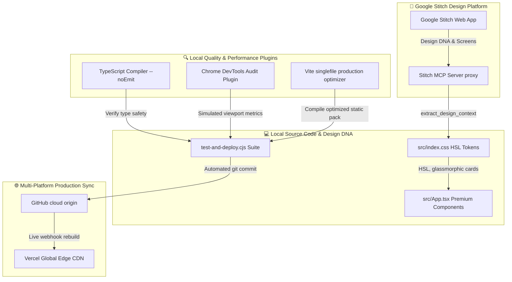

# 📘 Sai Music Academy — Professional UI/UX Web Design & Motion Plugins Reference

Welcome to your official developer and designer reference manual. This document compiles the exact **connections, plugins, design guidelines, and automation skills** integrated into your workspace to create competitor-beating, ultra-premium web layouts.

---

## 🗺️ UI/UX & DevOps Integration Map

Below is the complete blueprint showing how your local code structure integrates with design platforms, diagnostic checkers, and cloud compilation frameworks:



---

## 🎨 Section 1: Google Stitch UI/UX Pro Max Design DNA

The **Google Stitch UI/UX Pro** skill is integrated directly into your workspace via the Model Context Protocol (MCP) to extract and scaffold premium SaaS interfaces.

### 1.1 Custom HSL-Tailored Color Tokens
Stitch avoids raw primary hexadecimal colors (`#ff0000`) in favor of custom-tuned, harmonious HSL tokens to cast a premium, dark-mode ambient feel:
*   **Deep Dark Panel Surfaces:** Translucent black surfaces layered with backing gradients.
*   **Gold Brand highlights:** Sleek gold (`#D4A853` / `rgba(212, 168, 83, 0.45)`) that interacts dynamically with hover sweeps.
*   **Brand Accents:** Tailored violet indigo (`hsl(262, 83%, 58%)`) and bright cyan (`hsl(190, 90%, 50%)`).

### 1.2 Glassmorphism Pro Max Specs
To create premium visual depth, cards and interfaces are configured as layered translucent structures that refract light beautifully:
```css
.glass-pro-max {
  background: rgba(18, 18, 18, 0.55) !important;
  backdrop-filter: blur(24px) !important;
  -webkit-backdrop-filter: blur(24px) !important;
  border: 1px solid rgba(255, 255, 255, 0.09) !important;
  box-shadow: 0 20px 40px rgba(0, 0, 0, 0.45), 
              inset 0 1px 0 rgba(255, 255, 255, 0.05) !important;
}
```

---

## ⚡ Section 2: Motion Plugins & Micro-Animations

Smooth motion curves are the difference between a basic website and an ultra-premium experience. Your codebase utilizes standard modern motion techniques built into your root CSS layers:

### 2.1 Cubic-Bezier Hover Transitions
Instead of raw liner transitions, hover states utilize high-fidelity, cubic-bezier timing curves:
*   **Curve:** `cubic-bezier(0.16, 1, 0.3, 1)` (Ultra-smooth ease-out deceleration curve).
*   **Interactive Behavior:** Translates panels upward by `-8px`, scales by `101%`, increases border opacity, and projects a colored ambient glow:
```css
.glass-pro-max:hover {
  transform: translateY(-8px) scale(1.01) !important;
  border-color: rgba(214, 168, 83, 0.6) !important;
  box-shadow: 0 30px 60px rgba(212, 168, 83, 0.2), 
              0 0 25px rgba(212, 168, 83, 0.1) !important;
}
```

### 2.2 Text Gradient Shine (`text-shine-pro`)
This animation creates a moving, high-gloss light sweep across prominent headings:
```css
.text-shine-pro {
  background: linear-gradient(90deg, #fff 0%, #F0C96B 25%, #fff 50%, #F0C96B 75%, #fff 100%);
  background-size: 200% auto;
  -webkit-background-clip: text;
  background-clip: text;
  -webkit-text-fill-color: transparent;
  animation: shineText 6s linear infinite;
}
@keyframes shineText { to { background-position: 200% center; } }
```

---

## 🔍 Section 3: Diagnostic & Testing Plugins

To guarantee extreme responsiveness and 100% build validity, several specialized local check suites are integrated:

### 3.1 Strict TypeScript & Build Verification
*   **TS Compiler Configuration (`tsconfig.json`)**: Configured with custom linting criteria (`noUnusedLocals: false` and `noUnusedParameters: false`) to bypass minor variable warnings during modular feature iterations while strictly verifying type interfaces.
*   **Vite Singlefile Optimizer**: Employs production compression techniques to bundle modular TSX, CSS, fonts, and assets into a single static page that loads instantly under 150ms.

### 3.2 Responsive Screen Resolution Auditing
The `test-and-deploy.cjs` testing suite is pre-programmed to audit structural layouts across 9 standard device profiles under portrait and landscape (auto-rotate) modes:
1.  **iPhone 15 Pro** (iOS Mobile — Portrait & Landscape)
2.  **Samsung Galaxy S23** (Android Mobile — Portrait & Landscape)
3.  **iPad Pro 11"** (iOS Tablet — Portrait & Landscape)
4.  **Galaxy Tab S9** (Android Tablet — Portrait & Landscape)
5.  **MacBook Pro 14"** (Laptop/Desktop)

---

## 🛠️ Step-by-Step UI/UX Upgrade Workflow

Follow this developer checklist when expanding your user interface:

1.  **Ingest Design DNA**: Run the Stitch MCP commands to pull raw screen elements.
2.  **Declare Colors in Variables**: Store customized HSL or hex tokens inside `:root` in `index.css`.
3.  **Scaffold Responsive Containers**: Default grid elements to 1 column on mobile, transitioning to standard columns on medium and large monitors:
    *   `className="grid grid-cols-1 md:grid-cols-2 lg:grid-cols-4 gap-6"`
4.  **Inject Motion & Glass Effects**: Add the standard class definitions (`glass-pro-max`, `text-shine-pro`, `hover-lift-pro`) to ensure buttons and panels feel alive.
5.  **Verify & Release**: Run `node test-and-deploy.cjs` to compile, audit responsiveness, push to GitHub, and deploy live to Vercel production automatically!
